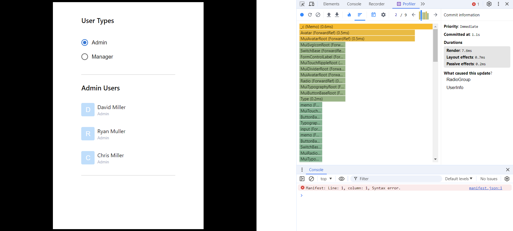

## Project Overview

This Project is Gin Huang's answer regarding Zeller Coding Challenge.
It is a simple single-page React application to show admins and managers of Zeller customers.
The project is created with create-react-app, TypeScript, Material UI, Tailwind CSS, and Cypress, and integrated with GraphQL APIs.

## Project Download

Open https://github.com/gin0753/zeller-coding-challenge to download the project, either use HTTPS or SSH to download the git project
git clone the project, then navigate to the project root directory and run `npm i`, then use `npm start` to run the project

### The approach

UserInfo.tsx is the index page of this application, which contains two components - List.tsx and Type.tsx; I used React queries and Axios to call the graphQL API and fetch the initial customer list. The initial role state is undefined, and users may use the radio buttons, either setting the state to Admin or Manager; The List title will be updated according to the role state, and the list of customers will be filtered based on the selection of user type: list admin customers if radio button selection is Admin, and list manager customers when the selection becomes Manager.

## Proper test coverage

The project test cases were created with Cypress, file location: cypress > e2e > firstTest.cy.ts, 
and comments were added to illustrate what does each test do

Use `npm run cypress:open` to start cypress testing
Select E2E Testing, then select Chrome or any preferred browser, then commence testing

Select Specs and find cypress > e2e > firstTest.cy.ts

The first test intercepts the GraphQL request and mocks a failure response which triggers an error message component

The second and third tests check user interactions: whether the radio button is checked after clicking;
the user list title should contain 'Admin/Manager'; each user should have a name and admin/manager role.

### Best practices for performance optimisation

This application is very straightforward with no expensive calculations or computations, therefore, useMemo or useCallback is unnecessary.

I did use one React.memo function to ensure that this child component(List.tsx) will not be re-rendered if the props are not changed, even if its parent component re-rendered. But in fact, the parent component(UserInfo.tsx) receives no props and won't be updated during
user interactions, so the React.memo function could be removed as well. 

I also used React fragment to remove unnecessary nodes on DOM which optimised the performance.

The project structure and React best practices secured the performance; I used the dev tool Profiler to monitor each render duration,
the longest duration is 7.6ms, which is not bad.

### Quality and Responsive UI

The application utilizes Tailwind CSS's responsive design:
The application removes black padding and takes all space when the device width is less than 640px; 
The application takes 3/5 screen width and has black padding when the device width is more than 640px;
The application allows scrolling to view overflow contents on the Y axis;
`
`